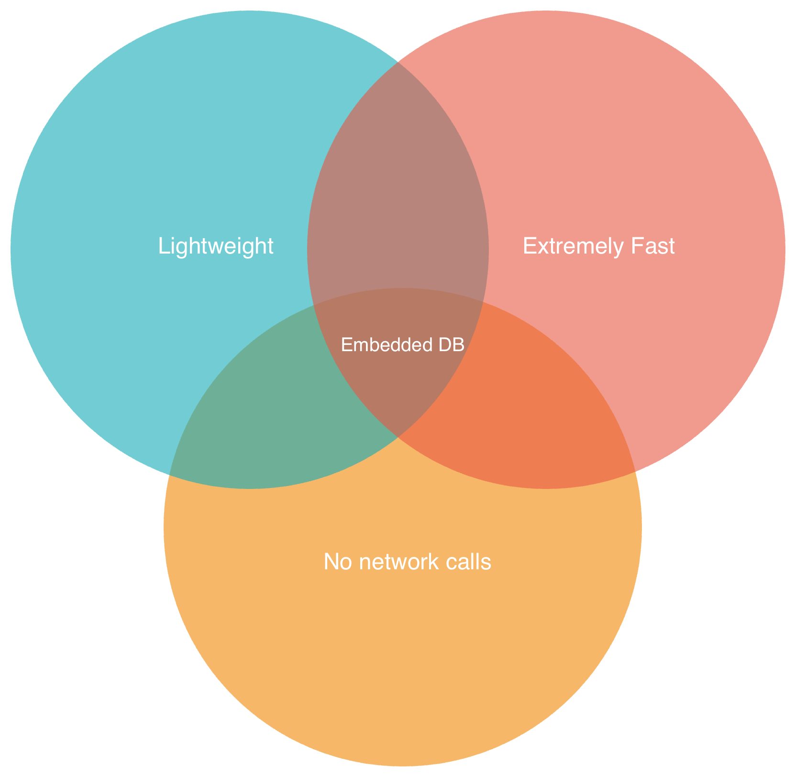
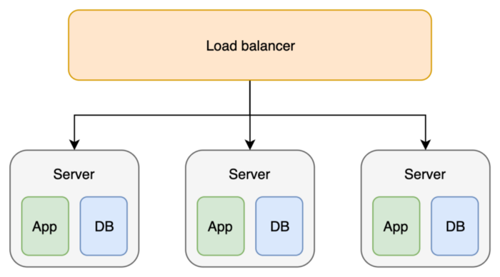
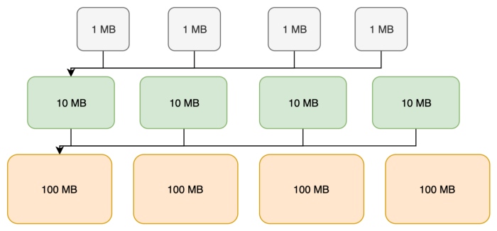
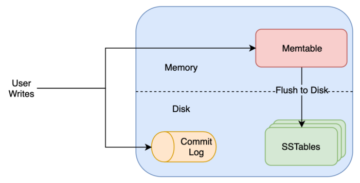

## Embedded DB

As the name implies, developers place embedded databases in the service/application using it. It means that if your application is running in container/server A, the database will also be present in the same place.

However, the apparent limitation of this design choice is that neither you won’t be able to guarantee the availability of the database nor you will be able to store the data beyond the capacity of your current machine.

## When should you use an embedded database?

You should use embedded DBs in cases when a lot of data needs to be stored, but the data can be recreated quickly and is not critical. 

## LevelDB and RocksDB

Although SQLite is fine in most cases, it suffers from a critical limitation. SQLite is a single-thread database and doesn’t support concurrent access. This inability to multi-thread makes it perform extremely slow in high throughput scenarios.

Due to this limitation, Google created **LevelDB**, which supported multi-threading. Facebook used LevelDB as a backbone to create **RocksDB**. 

Another popular embedded database that was created during this time is **LMDB**. LMDB has an entirely different architecture than LevelDB and performs remarkably better in specific scenarios.

## SSTables

Google created BigTable, which used SSTable underneath to store data. The same SSTables are used in RocksDB. SSTables store the data in key-value fashion. The data is also sorted based on keys. Sorting allows fast access to data since it is easy to search in sorted key-range.

[ssTable](https://www.igvita.com/2012/02/06/sstable-and-log-structured-storage-leveldb/)

SSTables are also immutable by nature. It means that you can read data from SSTable without worrying about it getting modified in mid (if there is a single SSTable).

Both LevelDB and RocksDB share the same table format except that RocksDB contains more types of metadata blocks. The metadata blocks contain file properties such as the dictionary used to prime the compression library or the filters to be used during compaction. 

## Log Structure Merged Tree

If you store the data in just a single SSTable, it can grow quite large and thus reduce the access time. Also, you can’t simply create multiple SSTables of fixed sizes as it will lead to the same issue as the number of files grows.

LSM trees were created to solve the above problem. When SSTable of fixed size grows beyond a number, they are merged to form a single SSTable of larger size. This step is known as compaction, which happens in the background. e.g., if the number of 10MB SSTable files go beyond 10, they are merged to create a single SSTable file of 100MB. For the new data, a new SSTable of the smallest size will be created e.g., 1MB.
The newest data is always found in the smallest files, while the oldest data resides in larger files.

## Memtables

The DB first inserts the data into a simple sorted in-memory structure known as Memtable as well as a file in disk known as a commit log. This makes accessing recent data extremely fast as it is already present in the memory.

Since the Memtable is already sorted, it is dumped into the disk to create an SSTable.

## Why not merely use LevelDB then?

RocksDB improves upon level DB in almost every aspect, which makes it an attractive choice compared to Google’s offering.

- **Don’t read the non-existant**: RocksDB takes the bloom filter approach to the next step. It implements a bloom filter for each Memtable and SSTable apart from the whole DB.

- **Update your keys without worries**: Column families are a mechanism that helps the user to partition the data in a single DB logically. A user can do safe atomic writes to multiple keys across column families.

- **Take a snapshot**: Since RocksDB doesn’t provide ACID guarantees, the data you read can change across multiple requests, e.g., due to compaction replacing one value with another.

- **Avoid partial updates**: RocksDB provides support for transactions with both pessimistic and optimistic concurrency control.

- Out of the box Rate Limiter to control the throughput to your DB

- Multi-threaded compactions which make them faster

- Multiple compression algorithms such as LZ4, GZIP, SNAPPY, etc.

